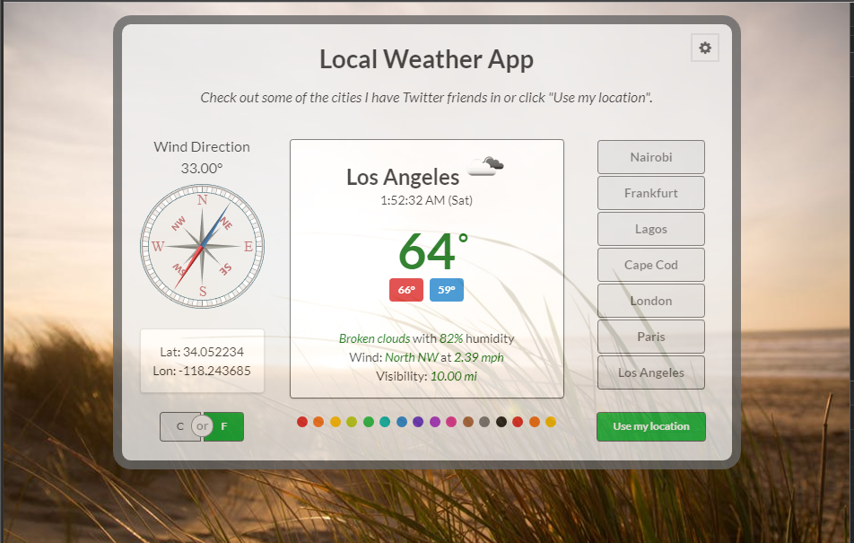
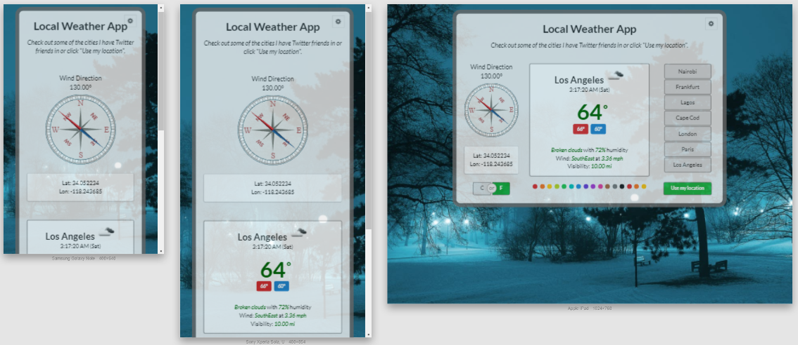
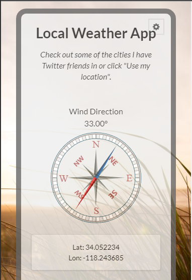
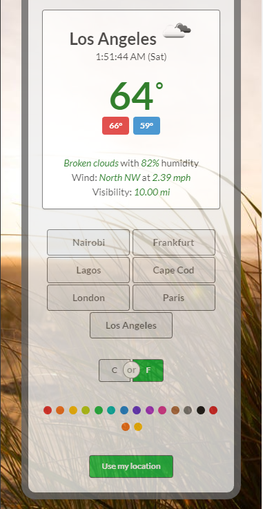

# Local Weather App

This is a Local Weather App that provides weather conditions for one of several cities. It uses Geolocation for the local city.

It is built using Semantic UI, jQuery, Geolocation API, SVG, CSS3 Animation, Ajax, and Web APIs.

You can test it at the following link.

Live Demo - [http://local-weather-app.netlify.com](http://local-weather-app.netlify.com/)

See below for [screenshots](#screenshots).

## Installation

Clone the repository and change directories.

```bash
$ git https://github.com/james-priest/local-weather-app.git
$ cd local-weather-app
```

No build environment is necessary. This can be run from the file system but ideally it should be run from any local http server.

Here are a couple links showing how to do this.

- [Simple HTTP Server](http://jasonwatmore.com/post/2016/06/22/nodejs-setup-simple-http-server-local-web-server) - Runs on Node.js
- [How to run things locally](https://threejs.org/docs/#manual/en/introduction/How-to-run-things-locally) - Instructions for , Node.js, Python, & Ruby

## Usage

The main functionality is located in the following files.

- index.html - markup
- js/script.js - behavior
- css/style.css - presentation

The other files are for testing transitions and other bits of logic.

## Screenshots

### Fullscreen



### Responsive layout



### Mobile



### Mobile 2


